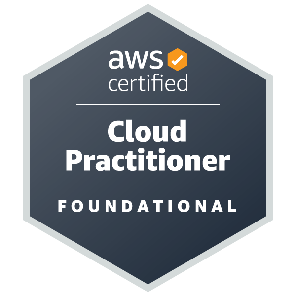

# Cloud & DevOps Portfolio

Hi! I'm an aspiring Cloud Infrastructure Engineer with a strong interest in AWS and DevOps practices.

This repository contains my cloud learning journey, hands-on labs, architecture diagrams, and certifications.

Currently studying and building hands-on labs involving:

- AWS Infrastructure
- Docker Containers
- Infrastructure as Code
- CI/CD pipelines
- Cloud Architecture fundamentals

## Certifications

AWS Certified Cloud Practitioner (CLF-C02)

View credential:
[https://www.credly.com/badges/](https://www.credly.com/badges/77d3254b-b931-4603-8012-0ad00557812a/public_url)

## ☁️ Skills

Cloud
- AWS (EC2, S3, IAM, VPC, CloudWatch)

DevOps
- Docker (learning)
- GitHub Actions
- Linux

Infrastructure as Code
- Terraform (learning)

Programming
- Python
- Bash

---

## 📦 Projects

## Projects

### Terraform AWS Lab
Hands-on infrastructure experiments using Terraform.

Repo:
https://github.com/seuusuario/terraform-aws-lab

---

### Docker Learning Lab
Experiments with Docker and containerized applications.

Repo:
https://github.com/seuusuario/docker-learning-lab

---

### GitHub Actions CI/CD
Automation and CI/CD pipeline experiments.

Repo:
https://github.com/seuusuario/github-actions-ci

---

## 🏗 Architecture Example

Example of a basic AWS cloud architecture.

# Docker Learning Lab

This repository documents my journey learning Docker.

Topics practiced:

- Creating Docker images
- Writing Dockerfiles
- Running containers
- Docker Compose basics

Goal:
Understand how containerization works and how it integrates with cloud infrastructure.

Next steps:
- Push images to Docker Hub
- Deploy container to AWS EC2

## CI/CD Pipeline

Continuous Integration pipeline using GitHub Actions.

Technologies:
- GitHub Actions
- Docker
- CI/CD

Repo:
(ci-cd repo link)

---

## 🎯 Goals
My goal is to become a Cloud Infrastructure Architect focused on scalable and reliable cloud systems.

Currently learning:

- Kubernetes
- Advanced Terraform
- AWS networking
- Observability

GitHub: https://github.com/lucasbertanicarneiro
Linkedin: 
